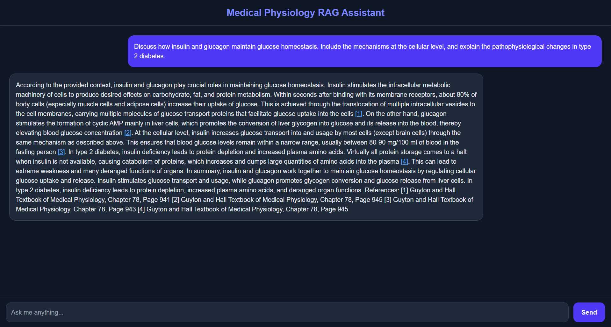
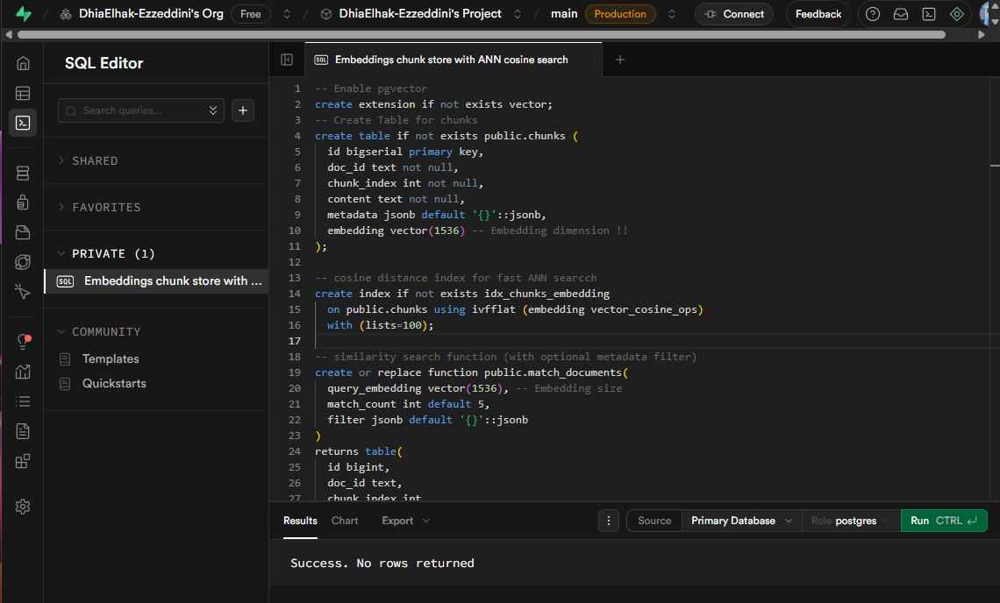
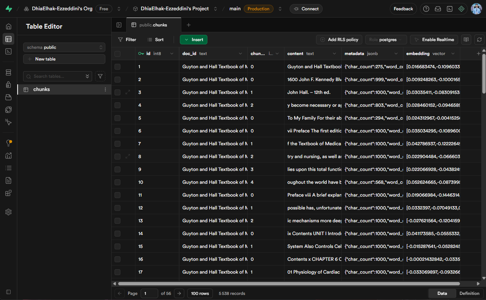

# Medical Physiology RAG Chatbot

This project implements a Retrieval-Augmented Generation (RAG) system to create a chatbot capable of answering questions based on the "Guyton and Hall Textbook of Medical Physiology." It uses a sophisticated pipeline to process the textbook, generate embeddings, store them in a vector database, and use them to provide contextually accurate answers to user queries through a web interface.

## Table of Contents

* [Project Overview](https://www.google.com/search?q=%23project-overview)
* [Architecture](https://www.google.com/search?q=%23architecture)
* [File Descriptions](https://www.google.com/search?q=%23file-descriptions)
* [Key Technologies](https://www.google.com/search?q=%23key-technologies)
* [Setup and Installation](https://www.google.com/search?q=%23setup-and-installation)
* [Usage](https://www.google.com/search?q=%23usage)

## Project Overview

The core of this project is to build a specialized AI chatbot that can "read" and understand a dense medical textbook. Instead of relying on a generic language model, this chatbot uses the specific content of the textbook to answer questions, making it a powerful tool for students, researchers, or medical professionals who need to quickly find information within this extensive resource. The RAG approach ensures that the answers are grounded in the source material, reducing hallucinations and improving accuracy.

## Architecture

The project follows a standard RAG pipeline with a few key components:

1.  **Document Processing**: The "Guyton and Hall Textbook of Medical Physiology" PDF is parsed, and its text content is extracted. This text is then split into smaller, manageable "chunks." This is a crucial step to ensure that the embeddings are created for specific, focused pieces of information.
2.  **Embedding Generation**: Each text chunk is converted into a numerical representation called an "embedding" using a sentence-transformer model. These embeddings capture the semantic meaning of the text, allowing for efficient similarity searches.
3.  **Data Ingestion & Storage**: The text chunks and their corresponding embeddings are stored in a Supabase PostgreSQL database, which is configured with the `pgvector` extension to handle vector data efficiently.
4.  **Retrieval**: When a user asks a question, the query is first converted into an embedding. The system then queries the Supabase database to find the text chunks with embeddings most similar to the query's embedding. This is the "retrieval" part of RAG.
5.  **Generation**: The retrieved text chunks are then passed as context to a large language model (Ollama with Llama3). The model uses this context to generate a coherent, human-readable answer to the user's original question. This is the "generation" part.
6.  **User Interface**: A Next.js application provides a simple chat interface for users to interact with the chatbot. The frontend sends user queries to a backend API route, which orchestrates the retrieval and generation steps.

## File Descriptions

Here's a breakdown of the key files and their roles in the project:

### Data Processing Notebooks (`.ipynb`)

* **`Document_Processing.ipynb`**: This Jupyter Notebook handles the initial stage of the pipeline. It reads the PDF of the textbook, extracts the text from each page, and processes it into smaller, semantically meaningful chunks. It also visualizes statistics about the chunk sizes.
* **`chunks_and_embeddings_df.csv`**: This CSV file is the output of the embedding generation process (likely performed after `Document_Processing.ipynb`). It contains the text chunks, their metadata (page number, word count, etc.), and the pre-computed vector embeddings for each chunk.
* **`ingest.ipynb`**: This notebook is responsible for "ingesting" the data from `chunks_and_embeddings_df.csv` into the Supabase database. It connects to Supabase and inserts each chunk, its metadata, and its embedding into the `chunks` table.
* **`Local_Full_Pipeline.ipynb`**: This notebook provides a complete, self-contained demonstration of the entire RAG pipeline locally. It shows how to take a user query, generate an embedding, retrieve relevant chunks from the stored data, and generate an answer using a local LLM. It's an excellent tool for testing and debugging the core logic.

### Web Application (`.ts`, `.tsx`)

* **`page.tsx`**: This is the frontend of the application, built with React/Next.js. It provides the chat interface, manages the conversation state (user messages and assistant responses), and communicates with the backend API. It also displays the source chunks for the assistant's answers, which is a key feature for verifying the information.
* **`route.ts`**: This is the backend API route for the chat functionality, located at `/api/chat`. It receives the user's message from the frontend. It then orchestrates the entire RAG process on the server side:
    1.  Generates an embedding for the user's query using a local embedding service.
    2.  Queries the Supabase database to retrieve relevant document chunks.
    3.  Constructs a prompt that includes the user's query and the retrieved context.
    4.  Calls a local Ollama instance to generate an answer based on the prompt.
    5.  Returns the final answer and the source chunks to the frontend.

### Chatbot Frontend
Here’s the simple and clean web interface built with Next.js and Tailwind:


## Key Technologies

* **Frontend**: Next.js, React, Tailwind CSS
* **Backend**: Next.js API Routes, Node.js
* **Database**: Supabase (PostgreSQL with `pgvector`)
* **LLM**: Ollama (running Llama3 or a similar model)
* **Embedding Model**: A local sentence-transformer model (e.g., from Hugging Face)
* **Data Processing**: Python, Jupyter Notebooks, Pandas, PyMuPDF

## Setup and Installation

To run this project, you will need to set up the different components: the backend/frontend application and the local AI models.

### Prerequisites

* Node.js and npm/yarn
* Python 3.x and pip
* Docker (for Supabase, or use the cloud version)
* Ollama installed and running locally. Pull a model like `llama3`.

### 1. Supabase Setup

1.  Set up a new project on [Supabase](https://supabase.com/) or run it locally using Docker.
2.  In the SQL Editor, enable the `vector` extension:

    ```sql
    create extension vector;
    ```

3.  Create a table to store the chunks and embeddings:

    ```sql
    create table chunks (
      id bigserial primary key,
      doc_id text,
      chunk_index int,
      content text,
      metadata jsonb,
      embedding vector(768) -- Make sure the dimension matches your embedding model
    );
    ```

4.  Create a function for similarity search:

    ```sql
    create function match_documents (
      query_embedding vector(768),
      match_count int,
      filter jsonb
    ) returns table (
      id bigint,
      content text,
      metadata jsonb,
      similarity float
    )
    language sql stable
    as $$
      select
        chunks.id,
        chunks.content,
        chunks.metadata,
        1 - (chunks.embedding <=> query_embedding) as similarity
      from chunks
      where chunks.metadata @> filter
      order by chunks.embedding <=> query_embedding
      limit match_count;
    $$;
    ```

5.  Get your Supabase URL and anonymous key and add them to your environment variables.
#### Supabase SQL Setup
This screenshot shows the SQL script used to create the `chunks` table and similarity search function:



#### Supabase Table
This screenshot shows the populated `chunks` table in Supabase with embeddings and metadata:



### 2. Run the Data Pipeline

1.  Run the `Document_Processing.ipynb` notebook to process the PDF and create the text chunks. This will likely output a CSV or DataFrame.
2.  Use a separate script (or adapt the notebook) to generate embeddings for each chunk and create the `chunks_and_embeddings_df.csv` file.
3.  Run the `ingest.ipynb` notebook to populate your Supabase database with the data from the CSV file.

### 3. Local AI Services

1.  **Ollama**: Make sure the Ollama server is running. You can run it with a command like `ollama serve`. Make sure you have pulled a model: `ollama pull llama3`.
2.  **Embedding Service**: The backend (`route.ts`) expects a local embedding service running at `http://localhost:8000/embed`. You'll need to set up a simple Python server (e.g., using FastAPI) that takes text and returns an embedding.

### 4. Web Application

1.  Navigate to the directory containing `page.tsx`.
2.  Create a `.env.local` file and add your Supabase credentials:

    ```
    SUPABASE_URL=your-supabase-url
    SUPABASE_ANON_KEY=your-supabase-anon-key
    ```

3.  Install the dependencies:

    ```bash
    npm install
    ```

4.  Run the development server:

    ```bash
    npm run dev
    ```

5.  Open your browser to `http://localhost:3000` to start chatting.

## Usage

Once all the components are running, you can open the web application. Type your question about medical physiology into the input box and press Enter or click "Send." The chatbot will retrieve relevant information from the textbook and generate an answer, displaying it along with the page numbers and text of the source chunks it used.
